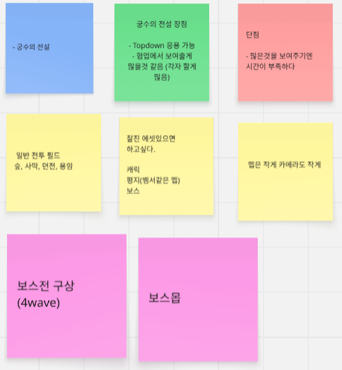
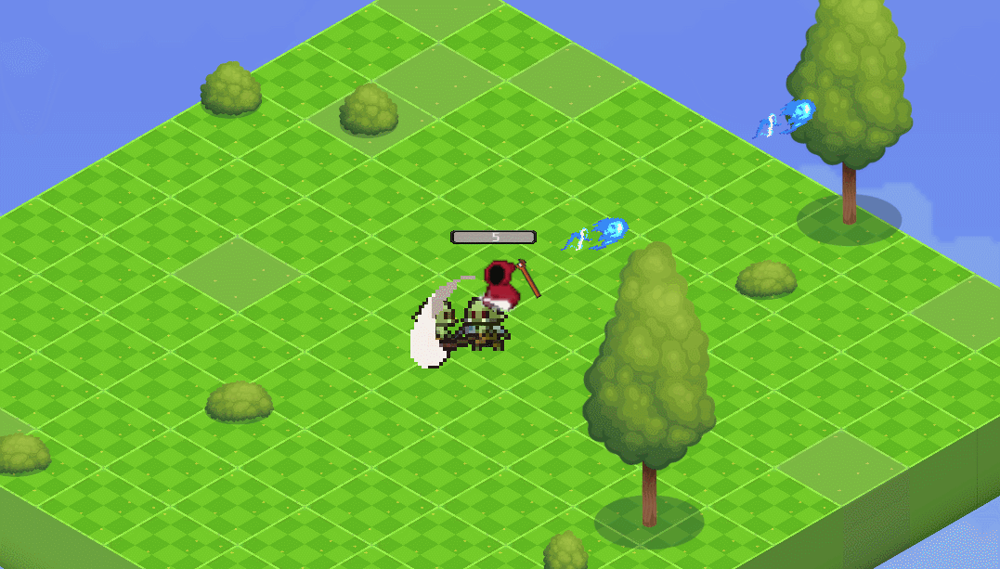
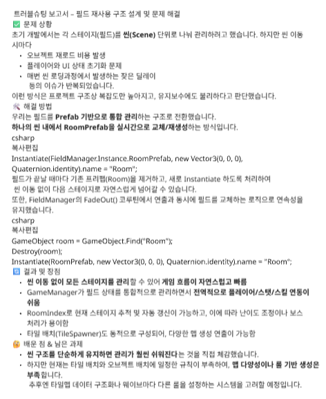
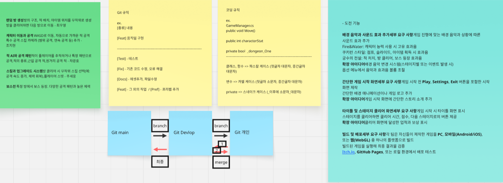

# Legend of RedHood
Legend of Archer를 모델로 만든 게임 

## 개발 기간
2025-07-29(화) ~ 2025-08-05(화)
## 기술
주 언어 : C#

Unity 버전 2022.03.17f1
## 기능
타이틀에서 게임을 시작시 던전 한가운데서 시작합니다.

W A S D = 이동

적이 있으면 마우스 방향으로 자동 공격

스테이지 클리어시 선택지가 등장하며 캐릭터를 강화해서 보스에게 도전합니다.

사망시 게임 오버가 나타납니다.

### 진행
타이틀 => 던전 => 보스

## 역할 분담
|이름|역할|
|----|----|
|조지현 (팀장)|캐릭터 이동 / 공격|
|차광호 (팀원)|적AI / 공격 패턴|
|최우영 (팀원)|랜덤 방 생성 / 맵 디자인|
|주세웅 (팀원)|스킬 / 업그레이드|

보스전 = 다 같이
## 트러블 슈팅

## Git

